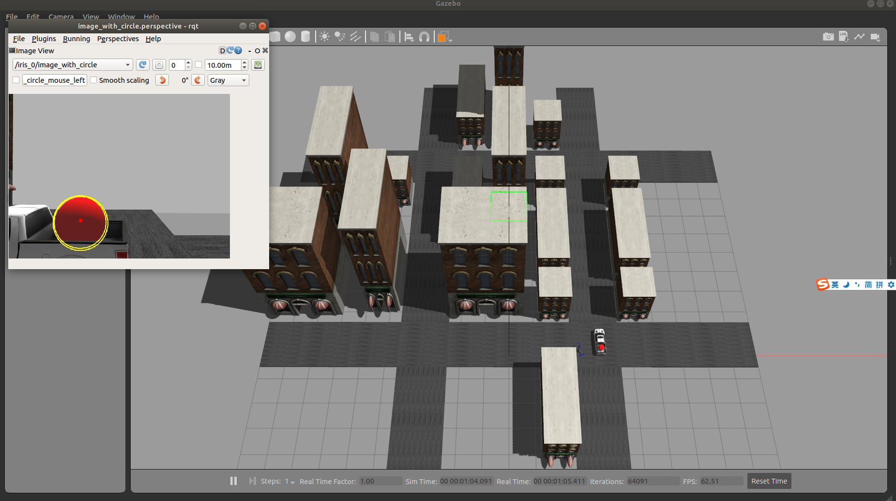
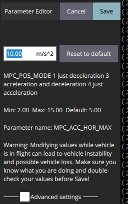

# uavcc-simulator
## Basic Configuration of Simulation Platform
See this [document](https://www.yuque.com/xtdrone/manual_en/basic_config) for the basic configuration of simulation platform

And then copy the launch files

```
cp *.launch ~/PX4_Firmware/launch/
cp trial_1_setup/trial_1.world ~/PX4_Firmware/Tools/sitl_gazebo/worlds/
cp trial_2_setup/trial_2.world ~/PX4_Firmware/Tools/sitl_gazebo/worlds/
```

## Trial 1 and 2 Configuration
This repository contains the Trial 1 and Trial 2 worlds that solutions will be tested in. 

Begin by cloning this repository onto your machine. Once it is downloaded, follow these steps to begin the simulation: 

Step 1: From the `trial_1_setup` and `trial_2_setup` directory, build the plugin
```mkdir build
cd build
cmake ../
cd ..
make
```
Step 2: Update the Gazebo plugin path so that the current path is included. Run this command from the build directory.

```
echo "export GAZEBO_PLUGIN_PATH=`pwd`:$GAZEBO_PLUGIN_PATH" >> ~/.bashrc
source ~/.bashrc
```

Step 3: Update the Gazebo model path so that the models can be loaded properly.
```
cd ~/the_repository_path
echo "export GAZEBO_MODEL_PATH=$GAZEBO_MODEL_PATH:$(pwd)/trial_1_setup:$(pwd)/trial_2_setup" >> ~/.bashrc
source ~/.bashrc
```

## Start the simulation

You can start the simulation in a script.

```
start_trial_1.sh
```

or

```
start_trial_2.sh
```



To finish the simulation, after ctrl+c, you should `killall -9 gzclient` to stop Gazebo.

You can calculate the score by

```
python score.py
```

You're expected to make sure whether the MPC_HOR_ACC_MAX parameter is 10 by using QGroundControl.


